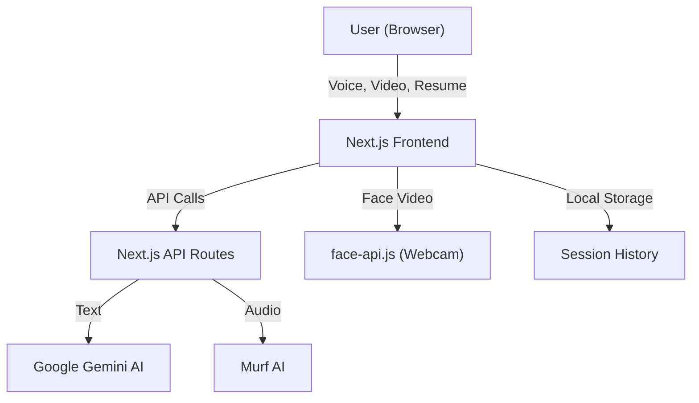

# AI-Interviewer

A next-generation AI-powered mock interview platform that delivers realistic, interactive interview experiences with dynamic feedback, mood and facial analysis, and personalized question generation based on your resume.

---

## Project Overview

**AI-Interviewer** is a sophisticated mock interview platform built with Next.js and TypeScript. It simulates real interview scenarios using AI-driven interviewers, real-time voice and facial analysis, and personalized question generation from your resume. The platform is designed for job seekers, students, and professionals to practice and improve their interview skills in a realistic, supportive environment.

---

## Tech Stack

**Frontend:**
- Next.js (App Router)
- React
- TypeScript
- Tailwind CSS (utility-first styling)
- Radix UI (accessible UI primitives)
- Lucide Icons (iconography)

**Backend:**
- Next.js API Routes (serverless functions)
- Node.js (runtime)

**AI/ML Integrations:**
- Google Gemini (Natural Language Processing, resume parsing, question generation)
- Murf AI (real-time voice synthesis)
- face-api.js (in-browser facial expression and eye contact analysis)
- @tensorflow/tfjs (underlying ML for face-api.js)

**Tooling & Utilities:**
- ESLint (linting)
- Prettier (code formatting)
- React Hook Form (form management)
- Zod (schema validation)
- date-fns (date utilities)
- Embla Carousel, Recharts, and other UI libraries
- LocalStorage (session history persistence)
- Node.js scripts for automation (model download, resume test)

---

## Table of Contents
- [Project Overview](#project-overview)
- [Features](#features)
- [Architecture](#architecture)
- [Directory & File Structure](#directory--file-structure)
- [API Endpoints](#api-endpoints)
- [Core Components](#core-components)
- [Custom Hooks](#custom-hooks)
- [Data Models & Types](#data-models--types)
- [AI & ML Integrations](#ai--ml-integrations)
- [Resume Upload & Processing Flow](#resume-upload--processing-flow)
- [Session Management & History](#session-management--history)
- [Static Assets](#static-assets)
- [Scripts & Utilities](#scripts--utilities)
- [Development, Setup & Testing](#development-setup--testing)
- [Configuration & Customization](#configuration--customization)
- [Contributing](#contributing)
- [License](#license)
- [Acknowledgments](#acknowledgments)

---

## Features

### Core
- **AI Interviewers**: Choose from multiple professional characters (Tech Lead, HR Manager, Product Manager), each with unique expertise and personality.
- **Multiple Interview Types**: Technical, Behavioral, and Case Study interviews, each with tailored question sets.
- **Real-time Voice Interaction**: Speak naturally with the AI interviewer; responses are synthesized using Murf AI.
- **Mood & Engagement Analysis**: Real-time mood meter and engagement feedback based on facial expressions and eye contact.
- **Facial Expression Tracking**: Uses face-api.js to analyze your expressions and engagement live via webcam.
- **Resume-Based Personalization**: Upload your resume (PDF, DOC, DOCX, TXT) to receive questions tailored to your experience and skills.
- **Session Analysis**: Receive detailed feedback, scoring, and recommendations at the end of each session.
- **Session History**: Access and replay past interview sessions, including all messages and feedback.
- **Multilingual Support**: Conduct interviews in English, Spanish, French, and Hindi (with extensible translation support).

### UI/UX
- **Responsive Design**: Fully functional on desktop and mobile.
- **Collapsible Sidebar**: Customizable workspace layout.
- **Modern UI**: Built with Tailwind CSS, Radix UI, and Lucide icons for a clean, accessible interface.
- **Progress Tracking**: Visual indicators for interview progress.
- **Dark Mode**: Toggle for comfortable viewing in any lighting.

---

## Architecture



- **Frontend**: Next.js App Router, React, TypeScript, Tailwind CSS, Radix UI
- **Backend**: Next.js API routes for message processing and resume extraction
- **AI Services**: Google Gemini (NLP), Murf AI (voice synthesis), face-api.js (facial analysis)
- **Storage**: Local storage for session history (no external DB)

---

## Directory & File Structure

```
AI-Interviewer/
├── app/                # Next.js app directory
│   ├── api/            # API routes (serverless functions)
│   │   ├── extract-resume/route.ts   # Resume extraction endpoint
│   │   └── process-message/route.ts  # Message processing endpoint
│   ├── globals.css     # Global styles
│   ├── layout.tsx      # App layout
│   └── page.tsx        # Main entry point
├── components/         # React UI components
│   ├── chat-canvas.tsx         # Chat interface
│   ├── resume-upload.tsx       # Resume upload & manual entry
│   ├── video-capture.tsx       # Webcam & face detection
│   ├── ...                     # Other UI and modal components
│   └── ui/                     # Reusable UI primitives (Radix wrappers, etc.)
├── data/              # Static data (characters, interview types, translations)
├── hooks/             # Custom React hooks (interview logic, sidebar, etc.)
├── lib/               # Utility libraries (Gemini, Murf, face detection)
│   └── hooks/         # Face detection logic
├── public/            # Static assets (models, avatars, audio)
├── scripts/           # Node scripts (model download, test upload)
├── styles/            # Additional CSS
├── types/             # TypeScript types and interfaces
├── package.json       # Project metadata and dependencies
├── tsconfig.json      # TypeScript configuration
└── README.md          # Project documentation
```

### Notable Files & Directories
- **app/page.tsx**: Main entry point, manages interview state, layout, and session logic.
- **app/api/extract-resume/route.ts**: API endpoint for extracting structured data from uploaded resumes using Gemini AI.
- **app/api/process-message/route.ts**: API endpoint for processing user messages, generating AI interviewer responses, and synthesizing audio with Murf AI.
- **components/**: All UI components, including chat, resume upload, video capture, modals, and a large set of reusable UI primitives in `components/ui/`.
- **data/**: Static data for interviewer characters, interview types, and translations.
- **hooks/**: Custom React hooks for interview logic, sidebar state, notifications, and mobile detection.
- **lib/**: Integrations for Gemini AI, Murf AI, and face detection logic.
- **public/**: Static assets, including face-api.js models, avatars, and audio files.
- **scripts/**: Node.js scripts for downloading models and testing resume upload.
- **types/**: TypeScript types and interfaces for all core data models.

---

## API Endpoints

### 1. `POST /api/extract-resume`
- **Purpose**: Extracts structured data from an uploaded resume file using Gemini AI.
- **Request**: `multipart/form-data` with a `resume` file (PDF, DOC, DOCX, TXT)
- **Response**:
  - `success`: boolean
  - `resumeData`: structured JSON (name, email, phone, summary, experience, education, skills, projects, achievements)
  - `warnings`: array of extraction/validation warnings
  - `error`: error message (if any)
- **Example**:
```json
{
  "success": true,
  "resumeData": {
    "name": "John Doe",
    "email": "john@example.com",
    "skills": ["React", "Node.js"],
    ...
  },
  "warnings": []
}
```

### 2. `POST /api/process-message`
- **Purpose**: Processes a user message, generates an AI interviewer response (via Gemini), and optionally synthesizes audio (via Murf).
- **Request**: JSON body with `{ message, character, interviewType, currentQuestion, isFeedback }`
- **Response**:
  - `success`: boolean
  - `processedMessage`: string (AI response)
  - `audioFile`: URL (if not feedback)
  - `timestamp`: number
  - `error`: error message (if any)
- **Example**:
```json
{
  "success": true,
  "processedMessage": "Can you tell me about a challenging project?",
  "audioFile": "https://.../audio.mp3",
  "timestamp": 1710000000000
}
```

---

## Core Components

- **`page.tsx`**: Main app logic, interview state, and layout.
- **`chat-canvas.tsx`**: Chat interface, voice controls, audio playback, and progress.
- **`resume-upload.tsx`**: Resume upload, validation, and manual entry fallback.
- **`video-capture.tsx`**: Webcam capture, face detection, and real-time feedback.
- **`sidebar.tsx`**: Character and interview type selection, session controls.
- **`session-modal.tsx`, `SessionSummaryModal.tsx`, `history-modal.tsx`**: Session management, feedback, and history replay.
- **`ui/`**: 40+ reusable UI primitives (buttons, dialogs, forms, tables, charts, etc.) built on Radix UI and Tailwind CSS.

---

## Custom Hooks

- **`useInterviewLogic`**: Centralized state and logic for interview flow, message handling, and session management.
- **`useFaceDetection`**: Loads face-api.js models, processes video frames, and extracts facial metrics (expressions, eye contact, confidence).
- **`useSidebarState`**: Sidebar open/close state management.
- **`useInterview`**: Additional interview state abstraction.
- **`use-toast`, `use-mobile`**: UI utility hooks for notifications and responsive design.

---

## Data Models & Types

### Interviewer Characters (`data/characters.ts`)
- **Jane Doe** (Tech Lead, frontend architecture)
- **Mike Chen** (HR Manager, behavioral interviews)
- **Sarah Wilson** (Product Manager, case study interviews)

### Interview Types (`data/interviewTypes.ts`)
- **Technical**: Coding challenges and system design
- **Behavioral**: Situational and experience-based questions
- **Case Study**: Problem-solving and analytical thinking

### Translations (`data/translations.ts`)
- English, Spanish, French, Hindi (easily extensible)

### Main Types (`types/index.ts`)
- `Character`, `InterviewType`, `InterviewCustomization`, `Message`, `ResumeData`, `SessionData`, `InterviewHistoryEntry`, etc.
- Includes validation helpers for resume data.

---

## AI & ML Integrations

- **Google Gemini AI**: Used for natural language understanding, question generation, and resume parsing. Integrated via `lib/gemini.ts`.
- **Murf AI**: Used for real-time voice synthesis of interviewer responses. Integrated via `lib/murf.ts`.
- **face-api.js**: Runs in-browser for real-time facial expression and eye contact analysis. Models are downloaded to `public/models` using `scripts/download-models.js`.

---

## Resume Upload & Processing Flow

1. **User uploads resume** (PDF, DOC, DOCX, TXT) via the UI.
2. **Frontend** sends the file to `/api/extract-resume`.
3. **API** uses Gemini AI to extract structured data (name, skills, experience, etc.).
4. **Validation**: Data is validated and warnings/errors are returned if needed.
5. **Personalized Questions**: Extracted data is used to generate interview questions relevant to the user's background.
6. **Manual Entry**: If extraction fails, user can manually enter summary and skills.

---

## Session Management & History

- **Session State**: Managed in React state and persisted to `localStorage`.
- **History**: Each completed session (character, type, resume, messages, score) is saved and can be replayed.
- **Session Analysis**: At the end of each session, the user receives a summary with strengths, areas for improvement, and a performance score.

---

## Static Assets

- **public/models/**: Pre-trained face-api.js models for face detection, landmark, and expression analysis.
- **public/avatars/**: Interviewer avatar images (e.g., `female_laptop.jpg`, `male_talking.jpg`, `female_mic.jpg`).
- **public/audio/**: Audio files generated by Murf AI for interview responses.
- **public/sample-resume.txt**: Example resume for testing and demonstration.
- **public/placeholder-*.{png,svg,jpg}**: Placeholder images for UI.

---

## Scripts & Utilities

- **scripts/download-models.js**: Downloads all required face-api.js models to `public/models`.
- **scripts/test-resume-upload.js**: Tests the resume extraction API with a sample resume, including validation logic.

---

## Development, Setup & Testing

### Prerequisites
- Node.js v18+
- npm or yarn
- Google Gemini API key
- Murf AI API key

### Setup
1. **Clone the repository**
```bash
git clone https://github.com/yourusername/ai-interviewer.git
cd ai-interviewer
```
2. **Install dependencies**
```bash
npm install
# or
yarn install
```
3. **Configure environment**
Create a `.env.local` file:
```
GEMINI_API_KEY=your_gemini_api_key
MURF_API_KEY=your_murf_api_key
```
4. **Download face-api.js models**
```bash
npm run download-models
```
5. **Start the development server**
```bash
npm run dev
```
6. **Test resume upload (optional)**
```bash
npm run test-resume
```

### Scripts
- `npm run download-models`: Downloads required face detection models to `public/models`.
- `npm run test-resume`: Tests the resume extraction API with a sample resume.

---

## Configuration & Customization

- **API Keys**: Required for Gemini and Murf. Place them in `.env.local`.
- **Model Files**: Downloaded to `public/models` for face-api.js.
- **Customizing Characters/Interview Types**: Edit `data/characters.ts` and `data/interviewTypes.ts`.
- **Translations**: Add/edit languages in `data/translations.ts`.
- **TypeScript Config**: See `tsconfig.json` for strict type settings and path aliases.

---

## Contributing

Contributions are welcome! To add features, fix bugs, or improve documentation, please follow these steps:

1. **Fork the repository**
2. **Clone your fork**
   ```bash
   git clone https://github.com/yourusername/ai-interviewer.git
   cd ai-interviewer
   ```
3. **Create a feature branch**
   ```bash
   git checkout -b feature/YourFeature
   ```
4. **Make your changes**
   - Follow the existing code style (TypeScript, Prettier, ESLint)
   - Add or update tests if applicable
   - Update documentation as needed
5. **Commit your changes**
   ```bash
   git commit -m 'Add YourFeature'
   ```
6. **Push to your branch**
   ```bash
   git push origin feature/YourFeature
   ```
7. **Open a Pull Request**
   - Go to the original repository on GitHub
   - Click "Compare & pull request"
   - Fill in the PR template and describe your changes

**Major changes:**
- For large features or breaking changes, please open an issue first to discuss your proposal with the maintainers.

**Code style:**
- Use TypeScript and follow the existing project conventions
- Run `npm run lint` and `npm run format` before submitting
- Write clear, descriptive commit messages

**Questions or Issues?**
- Open an [issue](https://github.com/yourusername/ai-interviewer/issues) for bugs, feature requests, or questions.

Thank you for contributing to AI-Interviewer!

---

## License

This project is licensed under the MIT License. See the [LICENSE](LICENSE) file for more details.

---

## Acknowledgments

We would like to thank the following individuals and organizations for their contributions to AI-Interviewer:

- **Google Gemini**: For providing the natural language processing and resume parsing capabilities.
- **Murf AI**: For the real-time voice synthesis technology.
- **face-api.js**: For the facial expression and eye contact analysis.
- **@tensorflow/tfjs**: For the underlying machine learning framework.

Thank you for your support and contributions!